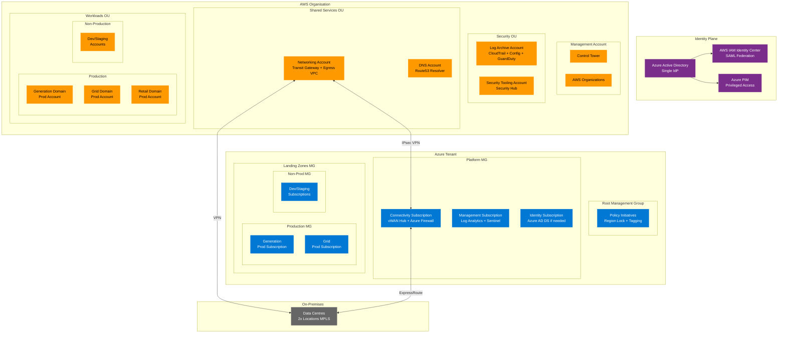
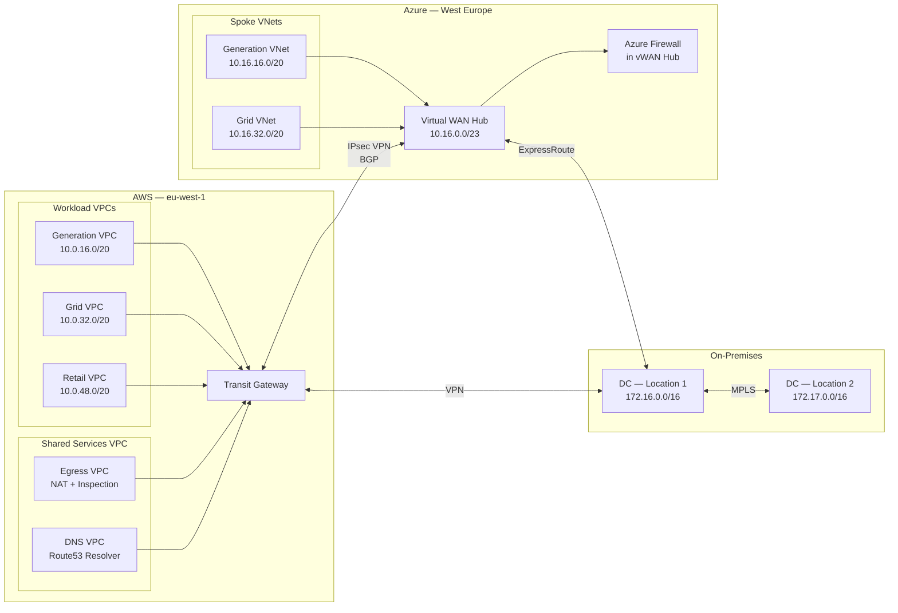
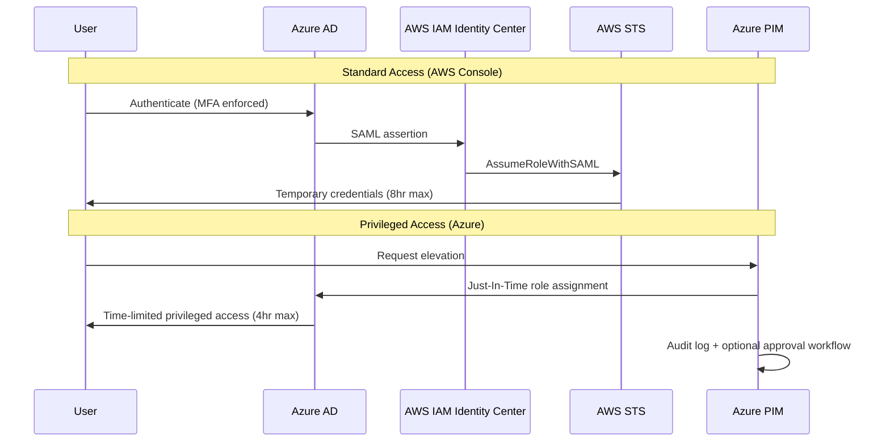
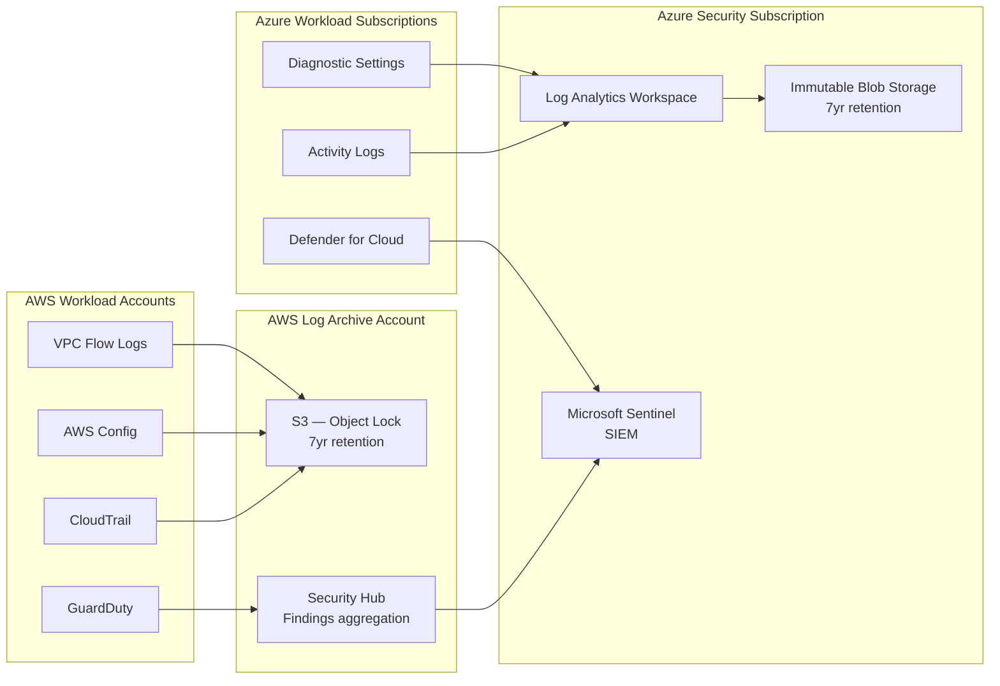

# Multi-Cloud Landing Zone — Architecture Diagrams

All diagrams are written in Mermaid and render natively in GitHub.

---

## 1. Overall Architecture

---

## 2. Network Topology

---

## 3. Identity Flow

---

## 4. Log Aggregation Flow

